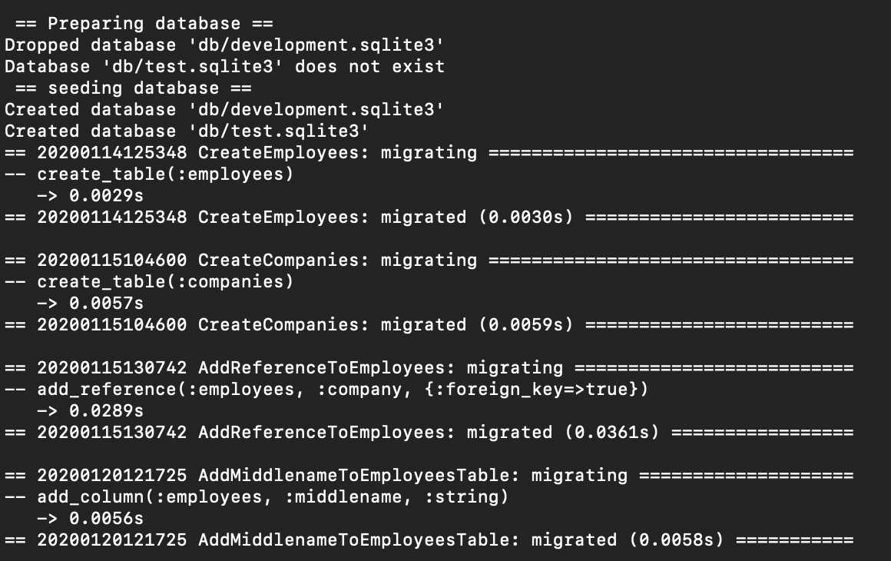
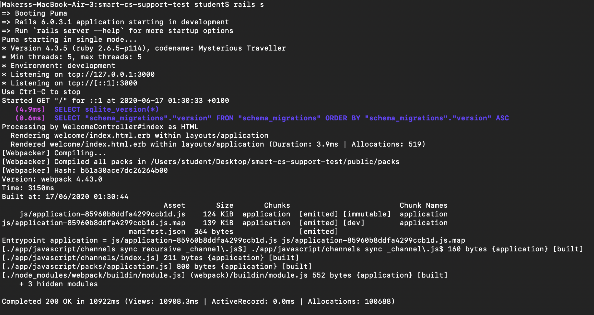

# Smart Pension Tech Test

## Setting up

Cloning repository with `git clone git@github.com:smartpension/smart-cs-support-test.git`.

Following the instructions to run the application and using the command `bin/setup`. The gem dependencies and databases were set up via the bundle installation.

I started the Rails server by typing `rails s` into the terminal.

## Navigating the website

`localhost:3000` - works fine and has two buttons *'Create New Company'* and *'Companies List'*

`localhost:3000/companies/new` - can navigate to the link by clicking *'Create New Company'* button on home page. We are presented with a form with a text input for *'Name'* of company and a text area to fill in for *'Details'*. A user can fill in duplicated company names and details (potential improvement one). They can also fill in a blank input for both entries (Bug one). At the bottom of the form there are two buttons. *'Save'* and the other *'Back to companies list'*.

`localhost:3000/companies/id` - the id param in the URL represents the newly added company's id. The new listing is appended to the end of the Company table in the database. However the data rendered on the table on this page always shows the first entry of the database (Bug two). There are two buttons at the bottom of the page *'Add Employee'* and *'Back to companies List'*. The employees' id are incorrectly labelled on the table (Bug three).

`local:3000/companies/1/employees` - clicking on the *Add Employee* renders a form to fill in with two text inputs. An input for Forename and another for Surname. There are two buttons at the end of the form named *'Save'* and *'Back to employees list'*. If the user leaves one of the inputs blank they are prompted with an error message. If the user leaves the 'Forename' input blank they are given an error with 'Forename can't be blank' and 'Middlename can't be blank' (Bug four). Filling in both inputs still gives an error of 'Surname can't be blank' (Bug five).

`local:3000/companies` - this page renders a table listing all the companies that are saved in the database. There are two buttons for each listing called *'Show'* and *'Destroy'*. Destroy prompts the user with an alert and asks if they are sure they would like delete this listing. The show button will navigate the user to the page `localhost:3000/companies/id`. At the bottom of the table there is a button that navigates to creating a new company.

## Recommendations

## Bug One

I would recommend setting validation to adding a company into the database similar to where the Forename and Surname fields are required to be filled when adding an employee.

## Bug Two

The path in the URL shows the correct id for the company but the table always displays the first company from the database. I think that there should be a conditional statement inside a loop to extract the correct company from the active record database and render the employees information onto the table.

## Bug Three

The id's for the employees on the table are labelled incorrectly. I think they should be labelled from 1 to x where x is the number of employees at the given company. They are currently labelled from 1 to y where y is the total number of employees at all companies combined. This is replicated by destroying the Mickey's Plaice company and clicking on a Show button.

## Bug Four

I'm not sure about precise definition of middlename, but I would recommend making a third input field labelled Middlename in between Forename and Surname. However this field would be optional unlike the other two because not all people have middlenames.

## Bug Five

Users are unable to add employees to any of the companies even though it only shows the list of employees from the first company inside the database. The error displayed is 'Surname can't be blank' even after filling in both fields. I suggest using the similar verification code for Forename and Surname, this will maintain reusable code and keep the Controller slim.
