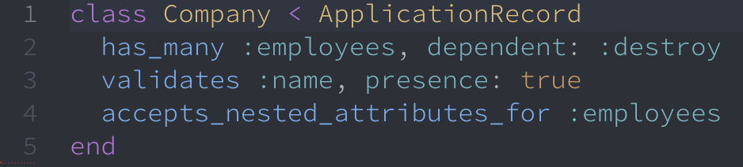

# Smart Pension Tech Test

| [Set Up](#Set-Up) | [Navigating](##Navigating-the-website-and-finding-the-bugs) | [Recommendations](##Recommendations) | [Solutions](##Possible-Solutions) | [GitHub Solutions](##GitHub-Solutions) |

## Set Up

Cloning repository with `git clone https://github.com/smartpension/smart-cs-support-test.git`.

Following the instructions to run the application and using the command `bin/setup`. The gem dependencies and databases were set up via the bundle installation.

I started the Rails server by using the `rails s` command in terminal.

## Navigating the website and finding the bugs

* `localhost:3000` - works fine and has two buttons **Create New Company** and **Companies List**

* `localhost:3000/companies/new` - can navigate to the link by clicking **Create New Company** button on home page. We are presented with a form with a text input for **Name** of company and a text area to fill in for **Details**. They can also fill in a blank input for both entries ([Bug One](#bug-One)). At the bottom of the form there are two buttons. **Save** and the other **Back to companies list**.

* `localhost:3000/companies/id` - the id param in the URL represents the newly added company's id. The new listing is appended to the end of the Company table in the database. However the data rendered on the table on this page always shows the first entry of the database ([Bug Two](#bug-Two)). There are two buttons at the bottom of the page **Add Employee** and **Back to companies List**. The employees' id are incorrectly labelled on the table ([Bug Three](#bug-Three)).

* `local:3000/companies/1/employees` - clicking on the **Add Employee** renders a form to fill in with two text inputs. An input for Forename and another for Surname. There are two buttons at the end of the form named **Save** and **Back to employees list**. If the user leaves one of the inputs blank they are prompted with an error message. If the user leaves the 'Forename' input blank they are given an error with 'Forename can't be blank' and 'Middlename can't be blank' ([Bug Four](#bug-Four)). Filling in both inputs still gives an error of 'Surname can't be blank' ([Bug Five](#bug-Five)).

* `local:3000/companies` - this page renders a table listing all the companies that are saved in the database. There are two buttons for each listing called **Show** and **Destroy**. Destroy prompts the user with an alert and asks if they are sure they would like delete this listing. The show button will navigate the user to the page `localhost:3000/companies/id`. At the bottom of the table there is a button that navigates to creating a new company.

## Recommendations

### Bug One

I would recommend setting requirement when adding a company into the database similar, to where the Forename and Surname fields are required to be filled when adding an employee.

### Bug Two

The path in the URL shows the correct id for the company but the table always displays the first company from the database. I think that there should be a conditional statement inside a loop to extract the correct company from the active record database and render the employees information onto the table.

### Bug Three

The id's for the employees on the table are labelled incorrectly. I think they should be labelled from `1` to `x` where `x` is the number of employees at the given company. They are currently labelled from `1` to `y` where `y` is the total number of employees at all companies combined. This is replicated by destroying the Mickey's Plaice company and clicking on a Show button.

### Bug Four

I'm not sure about precise definition of middlename, but I would recommend making a third input field labelled Middlename in between Forename and Surname. However this field would be optional unlike the other two because not all people have middlenames.

### Bug Five

Users are unable to add employees to any of the companies even though it only shows the list of employees from the first company inside the database. The error displayed is 'Surname can't be blank' even after filling in both fields. I suggest using the similar verification code for Forename and Surname, this will maintain reusable code and keep the Controller slim.

## Possible Solutions

These are potential solutions that can be made to the code to fix these issues.

### Solution to Bug One

This bug can be fixed by navigating to the Company Model in the path `'.app/models/company.rb'` and adding the line `validate :name, presence: true`. Shown below:

### Solution to Bug Two

Deleting the line 11 in the Company Controller fixes this bug, this file can be found at `.app/controllers/companies_controller.rb` The Company variable was being referenced to the first entry in the Company Database. Refer to the image below:

### Solution to Bug Three

Upon further inspection into the database I would need to refactor how the Employee table and Company are connected. The image below shows that the table correctly renders the Employee ID stored within the database so I believe this is not one of the three suggested bugs.

### Solution to Bug Four

Adding an extra field inside the new employee view is the same as adding the forename text input. 

To make the middlename parameter optional I deleted it from the validate parameters inside the employee model. The below code shows the updated Employee Model.

### Solution to Bug Five

The form label and text field were not the same, this meant that it could not get a surname input from the user and it was no possible to add a new employee because the surname field was required. Renaming the form text field to surname fixed this bug. The three input fields looks like this inside the employees/new path view.

## GitHub Solutions

Here is a [link](https://github.com/Jamie95187/smart-pension-fixes) to the app that has been corrected.
